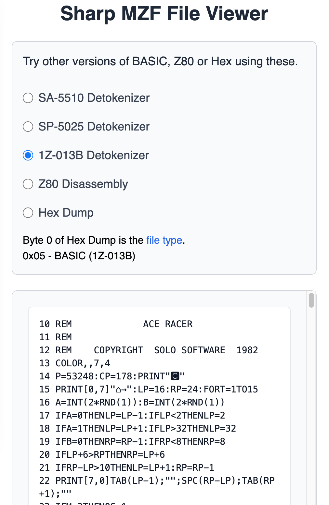

# MZFViewer
Sharp MZ computer file viewer

For SP-5025 and SA-5510 Basic

## Web version

You can access this tool at https://mzfviewer.web.app

https://mzfviewer.web.app/?url=https://mz-archive.co.uk/downloads/files/ACE-RACER-700.mzf&mode=1Z

## Features

You can drag a MZF file to the file box (or press the button).  It will detokenise the binary file into the BASIC code. You can do what you like with that code.

I recommend you switch between the versions of basic as there is no way to reliably detect which version is being used by the tape file.

## Background
I wanted a simple way to view MZF files used by Sharp MZ computer emulators like the MZ-80K, MZ-80A, and MZ-700. While I discovered https://github.com/tautology0/detokenisers for detokenising these files, I was looking for a web-based solution.

I saw the opportunity to experiment with Gemini for software development and to explore Rust and WebAssembly (WASM). After a day of sharing files and writing prompts, this tool was created.

Another day, and I used Claude.AI to create a z80 disassembler.  It wasn't happy to make so much code but, line by line in Visual Studio Code with the CoPilot extension, I was able to build a reasonable z80 disassembler.

One last task, and another 20 minutes with CoPilot, and we have a ascii/hex dump.

# Gemini, Claude.Ai and tautology0 detokenisers
. https://gemini.google.com
. https://claude.ai
. https://github.com/tautology0/detokenisers

# Build Instructions

You need [rustup](https://www.rust-lang.org/tools/install) and [wasm-pack](https://rustwasm.github.io/wasm-pack/installer/) and [http-server](https://www.npmjs.com/package/http-server).

. `wasm-pack build --target web --out-dir public/pkg && cp index.html public/index.html`

. `http-server public`

### Finally this does a good release of HTML and JS code and starts the sinclair target

`npm run dev`
